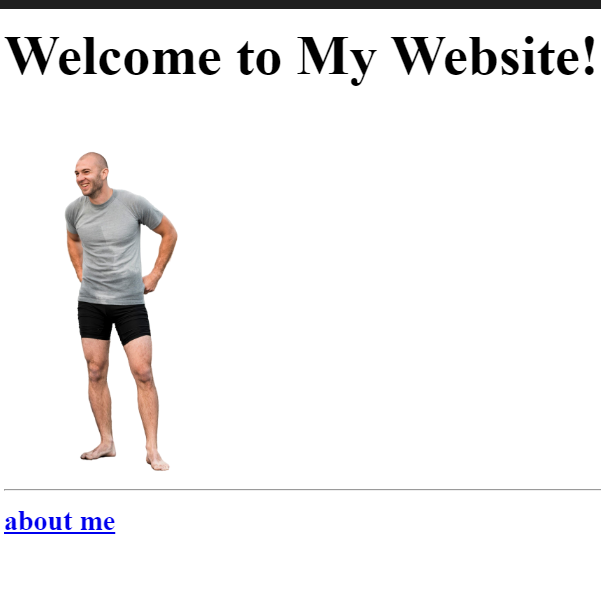

# html-portfolio
WIP - only for practice, not a real one

<!-- TODO 1: Create the HTML Boilerplate -->
<!DOCTYPE html>
<html lang="en">
<head>
    <meta charset="UTF-8">
    <title>Isaac's portfolio</title>
</head>
<body>
    <!-- TODO 2: Add Your previous projects' HTML into the public folder -->

<!-- TODO 3: Take screenshots of your project previews and add the images to the images folder -->

<!-- TODO 4: Add titles/subtitles etc. -->
<h1>Isaac Anchislavsky's portfolio</h1>
<h2>I'm getting to be a web dev!! </h2>

    <h3><a href="./public/birthday-invite.html" > <strong>Birthday Invite</strong></a></h3>
    
    <h3><a href="./public/movie-ranking.html" > <strong>Movie Ranking</strong></a></h3>
    
    <h3><a href="./public/multipage.html" > <strong>Multi-page</strong></a></h3>
    

<!-- TODO 5: Add a link to the project pages -->

<!-- TODO 6: Add images to show the project previews
HINT for TODO 6: You can use the height attribute set to 200 to make the image smaller:
https://developer.mozilla.org/en-US/docs/Web/HTML/Element/img#attr-height -->
<h2><a href="./public/contact.html" >contact me </a></h2>
<h2><a href="./public/about.html" > about me</a></h2>
<!-- TODO 7: Add the Contact Me and About Me page links -->
</body>
</html>
